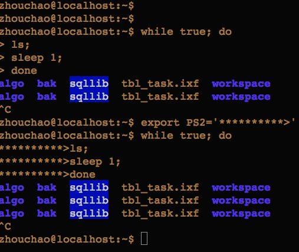

## 提示符(prompt symbol)
1. 一级提示符, 

   * 一般情况下root提示符以`#`结尾, 如
   
     ```
     [root@ypcs /home/hary] #
     ```
   * 普通用户的提示符以`$`结尾
    
     ```
     [hary@ypcs /opt] $
     ```
   * 一级提示符是通过环境变量`$PS1`来设置值的
   * 例子
   
     


2. 二级提示符

   * 二级提示符是指命令的子命令的提示符
   * 二级提示符是通过环境变量`$PS2`来设置值的
   * 例子
   
     
     
3. 查看提示符设置

   ```
   hary@localhost:/$ set | grep PS
   GROUPS=()
   PS1='\[\e]0;\u@\h: \w\a\]${debian_chroot:+($debian_chroot)}\u@\h:\w\$ '
   PS2='> '
   PS4='+ '
   ```
   
   > \u \h \w \a的含义， 请baidu or google
   
