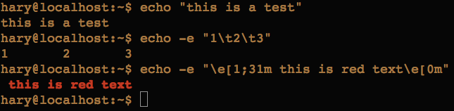

## 终端打印
1. echo命令

   
   
   说明
   
   ```
   1. -e 包含转义序列的字符串
   2. 颜色输出
      - \e[1;31m  : 红色
      - \e[1;30m  : 黑色
      - \e[1;40m  : 黑色
      - \e[1;41m  : 黑色
      - \e[1;42m  : 黑色
      - \e[1;43m  : 黄色
      - \e[1;44m  : 蓝色
      - \e[1;45m  : 洋色
      - \e[1;46m  : 青色
      - \e[1;47m  : 白色
      - \e[0;m    : 颜色置回
      
   ```
2. printf命令

   ```
   gardenia:01 zhouchao$ cat  printf.sh 
   #!/bin/bash

   printf "%-5s %-10s %-4s\n"  NO. Name Mark
   printf "%-5s %-10s %-4s\n"  1 Sarath 80.3456
   printf "%-5s %-10s %-4s\n"  2 James 90.9989
   printf "%-5s %-10s %-4s\n"  3 Jeff 77.564
   gardenia:01 zhouchao$ ./printf.sh 
   NO.   Name       Mark
   1     Sarath     80.3456
   2     James      90.9989
   3     Jeff       77.564
   gardenia:01 zhouchao$ 
   
