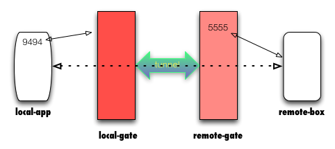

# SSH端口转发-远程转发

## 问题描述
1. 假设有四台主机分别为

   ```
   remote-gate : 127.0.1.1  # 远程的ssh服务器, 有个用户rg
   remote-box  : 127.0.1.2  # 远程的某个应用, 
   
   local-gate  : 127.0.0.1  # 远程的ssh服务器, 有个用户lg
   local-app   : 127.0.0.2  # 远程的某台pc机器
   ```
2. local-app上有个服务在9494端口上提供服务

   ```
   #!/usr/bin/perl
   use Zeta::POE::HTTPD;
   use POE;

   Zeta::POE::HTTPD->spawn( 
       ip       => '127.0.02',
       port     => 9494, 
       callback => sub { 'hello world'; },
   );
   $poe_kernel->run();
   exit 0;
   ```
3. 现在remote-box这台机器要访问local-app上的9494这个服务

# 解决方案
1. 在local-gate上执行

   ```
   ssh -CfNg -R 5555:local-app:9494 rg@remote-gate
   # 解释
   # 1. 将使得remote-gate上启一个后台进程在5555端口listen
   # 2. 当remote-box访问remote-gate:5555时, local-gate将访问local-app:9494
   # 3. 看起来好像是remote-box直接访问local-app一样
   ```
2. 图示

   

3. 例子
   ```
   # 在local-app上启动9494服务
   ./svc.pl '127.0.0.2' 9494

   # 在local-gate(127.0.0.1)上建立本地转发隧道
   ssh -CfNg -R 5555:127.0.0.2:9494 zhouchao@127.0.1.1

   # 在remote-box发起到127.0.1.1:5555访问
   GET 'http://127.0.1.1:5555/'
   ```

